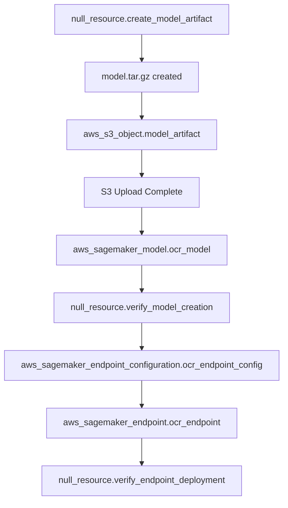

# Pure Terraform OCR Pipeline Implementation

## Overview
This implementation uses **only Terraform** to manage the entire OCR pipeline deployment, including model creation, upload, and verification using `null_resource` and `aws_s3_object` resources.

## 🏗️ Architecture Components

### 1. Model Creation (null_resource)
```hcl
resource "null_resource" "create_model_artifact" {
  triggers = {
    always_run = timestamp()
  }
  
  provisioner "local-exec" {
    command = <<-EOT
      # Creates model.tar.gz with placeholder OCR model
      # Includes proper SageMaker inference code
    EOT
  }
}
```

### 2. Model Upload (aws_s3_object)
```hcl
resource "aws_s3_object" "model_artifact" {
  bucket = aws_s3_bucket.sagemaker_bucket.bucket
  key    = "models/model.tar.gz"
  source = "${path.module}/model.tar.gz"
  etag   = filemd5("${path.module}/model.tar.gz")
  
  depends_on = [null_resource.create_model_artifact]
}
```

### 3. Model Verification (null_resource)
```hcl
resource "null_resource" "verify_model_creation" {
  provisioner "local-exec" {
    command = <<-EOT
      # Verifies SageMaker model exists
      aws sagemaker describe-model --model-name ${aws_sagemaker_model.ocr_model.name}
    EOT
  }
}
```

### 4. Endpoint Verification (null_resource)
```hcl
resource "null_resource" "verify_endpoint_deployment" {
  provisioner "local-exec" {
    command = <<-EOT
      # Waits for endpoint to be in service
      aws sagemaker wait endpoint-in-service --endpoint-name ${aws_sagemaker_endpoint.ocr_endpoint.name}
    EOT
  }
}
```

## 🚀 Deployment Methods

### Method 1: Complete Deployment
```bash
# Refresh credentials
aws sso login --profile test-prod

# Run comprehensive deployment
./terraform_deploy.sh
```

### Method 2: Targeted Fix (Model Only)
```bash
# Fix just the model artifact issue
./fix_model_artifact.sh

# Continue with full deployment
terraform apply -auto-approve
```

### Method 3: Manual Step-by-Step
```bash
# Step 1: Core infrastructure
terraform apply -target=aws_s3_bucket.sagemaker_bucket -auto-approve

# Step 2: Create and upload model
terraform apply -target=null_resource.create_model_artifact -auto-approve
terraform apply -target=aws_s3_object.model_artifact -auto-approve

# Step 3: Create SageMaker resources
terraform apply -target=aws_sagemaker_model.ocr_model -auto-approve
terraform apply -target=null_resource.verify_model_creation -auto-approve

# Step 4: Complete deployment
terraform apply -auto-approve
```

## 🔄 Terraform Resource Flow



## ✅ Benefits of Pure Terraform Approach

### 🎯 **Infrastructure as Code**
- **Declarative**: All resources defined in Terraform configuration
- **Version Control**: Infrastructure changes tracked in Git
- **Reproducible**: Same deployment across environments

### 🔄 **State Management**
- **Dependency Tracking**: Proper resource dependencies
- **Change Detection**: Terraform knows when files change (`etag`)
- **Rollback Capability**: Can destroy and recreate consistently

### 🛡️ **Reliability**
- **Idempotent**: Safe to run multiple times
- **Error Handling**: Built-in retry and validation
- **Verification**: Null resources verify deployment success

### 📊 **Observability**
- **Terraform Output**: Clear deployment status
- **Resource Tracking**: All resources in Terraform state
- **Validation**: Multiple verification steps

## 🔧 Troubleshooting

### Model Creation Issues
```bash
# Check model creation logs
terraform apply -target=null_resource.create_model_artifact -auto-approve

# Verify file exists
ls -la model.tar.gz
```

### Upload Issues
```bash
# Check S3 upload
terraform apply -target=aws_s3_object.model_artifact -auto-approve

# Verify in S3
aws s3 ls s3://your-bucket/models/
```

### SageMaker Issues
```bash
# Check model status
aws sagemaker describe-model --model-name your-model-name

# Check endpoint status
aws sagemaker describe-endpoint --endpoint-name your-endpoint-name
```

## 📋 Key Files Modified

1. **`sagemaker_pipeline.tf`**
   - Added `null_resource.create_model_artifact`
   - Updated `aws_s3_object.model_artifact` dependencies

2. **`sagemaker_endpoint.tf`**
   - Added `null_resource.verify_model_creation`
   - Added `null_resource.verify_endpoint_deployment`
   - Updated dependencies

3. **`terraform_deploy.sh`**
   - Pure Terraform staged deployment
   - No manual AWS CLI commands

4. **`fix_model_artifact.sh`**
   - Terraform-only model fix
   - No redundant uploads

## 🎉 Result

The entire OCR pipeline now uses **only Terraform** for:
- ✅ Model creation via `null_resource`
- ✅ Model upload via `aws_s3_object` 
- ✅ SageMaker resource creation
- ✅ Deployment verification via `null_resource`
- ✅ No manual AWS CLI uploads
- ✅ Complete infrastructure as code
